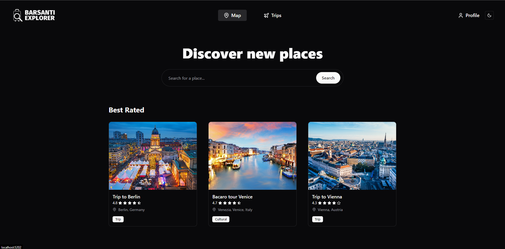
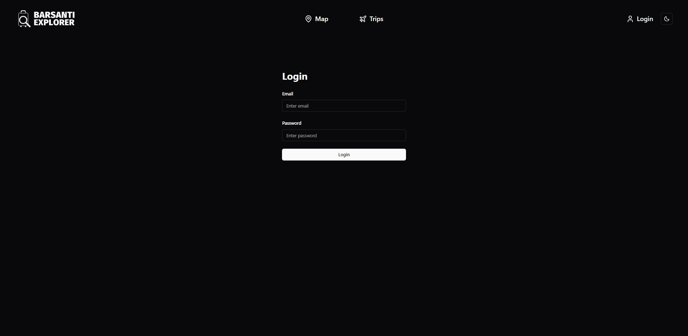
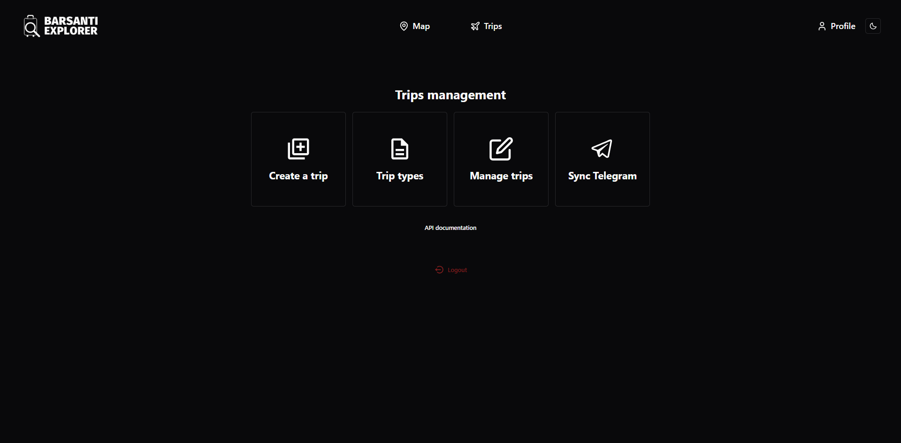
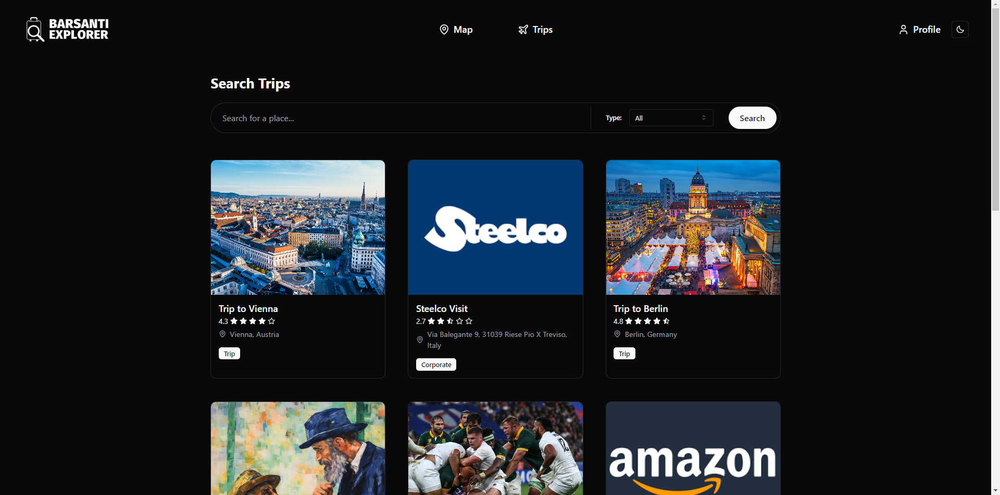
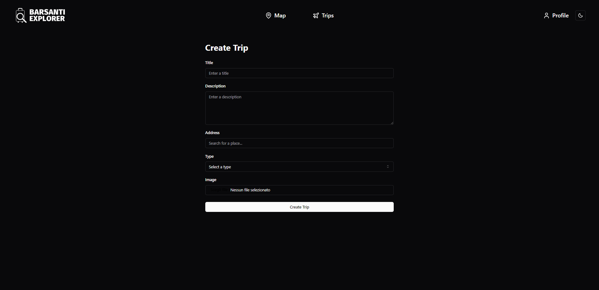
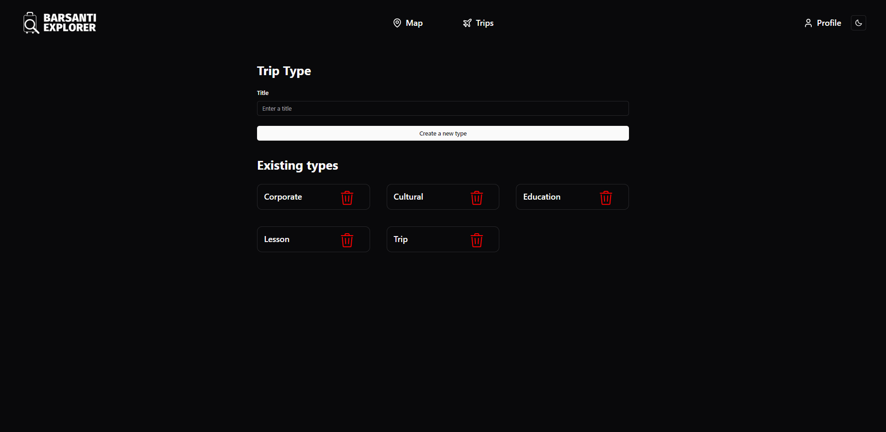
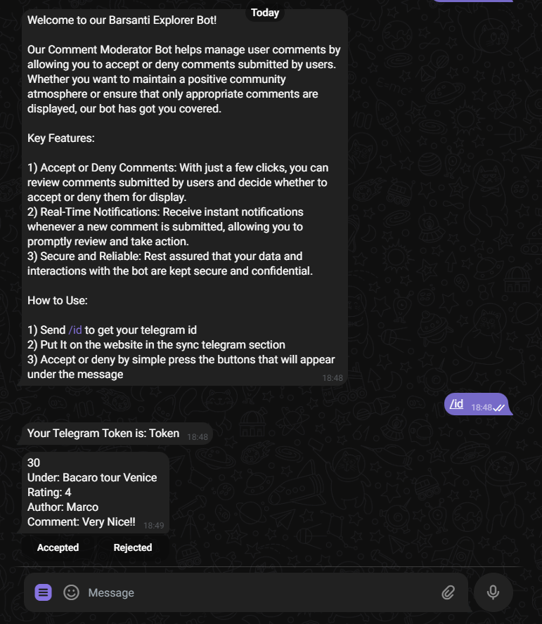

# Barsanti-Explorer
## Web app advisor for barsanti trips
Written with React, Typescript, Tilewind css for frontend and .Net for backend, this website is school project to show users school trip and lessons, also allow users to add comments to trips only if they're accepted by an admin.

# Previews

## Home Preview



## Login Preview



## Dashboard Preview



## Manage Trips Preview



## Create Trips Preview



## Manage Trips Type Preview



# Telegram
This website allow admin to check users comments by using a telegram bot, you must sync your telegram ID with the website in order to receive comments from the bot. \

If there're multiple admins, the bot will considering the first respond, and will notify all the admins that the comments are been accepted or rejected.

## Example Chat with bot



# Installation
In order to start the website you have to 

### add an appsetting with this template

```json
// Appsettings.Production.json
{
  "Logging": {
    "LogLevel": {
      "Default": "Information",
      "Microsoft.AspNetCore": "Warning"
    }
  },
  "AllowedHosts": "*",
  "ConnectionStrings": {
    "DefaultConnection": "Server=127.0.0.1;User=root; Database=BarsantiExplorer; Password=password"

  },
  "JwtOptions": {
    "Issuer": "domain name",
    "Audience": "domain name",
    "SigningKey": "your key",
    "ExpirationHours": 3
  },
  "UploadDir": "uploads",
  "BotApiToken": "Bot token"
}
```
### And then create your database 
In order to create your database you have run this command in the Package Manager console, the migrtions will create the database
``` console
Update-Database
```

Now you can start the project and reach the website on
`localhost:5202`

